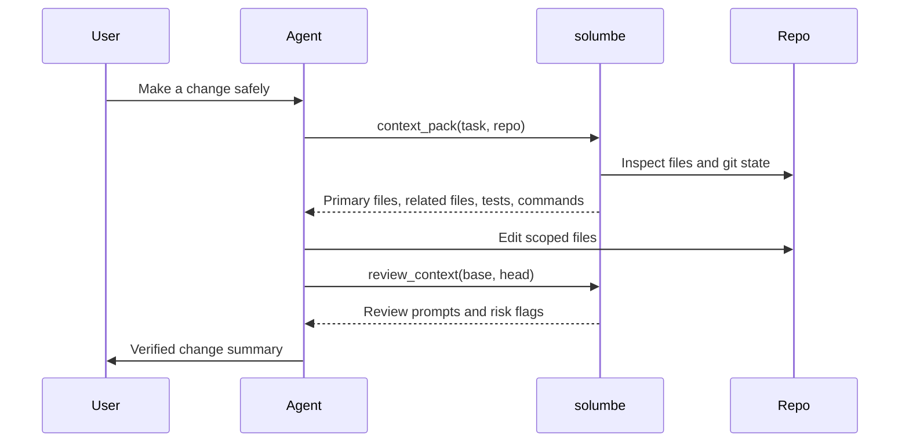

# MCP and Agent Workflows

solumbe can run as a stdio MCP server so agent hosts can ask for repository context without scraping terminal output.

---

## Start The Server

Install the published package when you want Solumbe available as a local command:

```bash
npm install -g @bashbop/solumbe
solumbe doctor
```

Or start from a local checkout:

```bash
git clone https://github.com/BASHBOP/solumbe.git
cd solumbe && npm ci
node src/cli.js doctor
```

```bash
node src/cli.js mcp
```

The MCP server uses stdio. The agent host starts `solumbe mcp` as a child process and speaks JSON-RPC over standard input and output.

---

## Connect Your Agents

One command adds Solumbe to every agent host it finds on the machine:

```bash
solumbe install --host all
```

| Host | Where the entry goes |
| --- | --- |
| Claude Code | user scope, through `claude mcp add-json` |
| Claude Desktop | `claude_desktop_config.json` |
| Codex CLI | `~/.codex/config.toml`, through `codex mcp add` |
| Cursor | `~/.cursor/mcp.json` |
| VS Code | user `mcp.json` |
| Gemini CLI | `~/.gemini/settings.json` |
| Kimi Code CLI | `~/.kimi-code/mcp.json` |

- `--host claude-code,cursor` configures only the hosts you name, and fails if one of them is missing.
- `--dry-run` prints what would change and touches nothing.
- `--canvas http://127.0.0.1:7801` adds the [Realtime Canvas](#realtime-canvas-and-model-routing-opt-in) variables to each host.
- `--json` returns the result for scripts.

Before it writes anything, the installer starts the server once and checks that it answers an MCP `initialize` request. Each host gets the absolute path of `node` and of Solumbe's CLI, not a bare `solumbe` command, because Claude Desktop, Cursor and VS Code start servers without your shell `PATH`, so under nvm, Volta or Homebrew they cannot find `solumbe` or `node` on their own. JSON configs are merged in place, and the original is kept as `<file>.solumbe.bak`. A config it cannot parse, such as a `mcp.json` with comments, is left untouched and reported. An existing `solumbe` entry is replaced. Other entries that still launch Solumbe, such as one left from before the 4.0.0 rename, are listed so you can remove them.

Restart each host after running it. Run it again after you upgrade Node or move a checkout, so the pinned paths stay current.

The sections below show what the installer writes, for setting up a host by hand.

---

## MCP Client Examples

Use the installed `solumbe` binary where available. A local checkout is equally
valid when you are developing Solumbe itself.

### Generic stdio client

Many MCP clients use this shape:

```json
{
  "mcpServers": {
    "solumbe": {
      "command": "node",
      "args": ["/absolute/path/to/solumbe/src/cli.js", "mcp"],
      "env": {}
    }
  }
}
```

Some hosts also require an explicit `"type": "stdio"` field. Check the host's current MCP schema before copying a config into a shared repository.

For a local checkout instead of a global install:

```json
{
  "mcpServers": {
    "solumbe": {
      "command": "node",
      "args": ["/path/to/solumbe/src/cli.js", "mcp"],
      "env": {}
    }
  }
}
```

Keep `/path/to/solumbe` as a private local path. Do not commit machine-specific absolute paths to public documentation or shared repositories.

### Claude Code

Add the server at user scope so every project sees it:

```bash
claude mcp add-json solumbe '{"type":"stdio","command":"solumbe","args":["mcp"]}' --scope user
```

Use `--scope project` to write a shared `.mcp.json` into one repository instead. Run `claude mcp list` to confirm it shows `solumbe ... Connected`, then start a new session; the tools appear as `mcp__solumbe__*`.

### Claude Desktop

Claude Desktop uses `claude_desktop_config.json` with a top-level `mcpServers` object.

| OS | Config file |
| --- | --- |
| macOS | `~/Library/Application Support/Claude/claude_desktop_config.json` |
| Windows | `%APPDATA%\Claude\claude_desktop_config.json` |

```json
{
  "mcpServers": {
    "solumbe": {
      "type": "stdio",
      "command": "solumbe",
      "args": ["mcp"],
      "env": {}
    }
  }
}
```

Claude Desktop starts servers without your shell `PATH`, so under nvm, Volta or Homebrew a bare `solumbe` may not be found. Use the absolute paths from `which node` and `npm root -g` (`"command": "/path/to/node"`, `"args": ["/path/to/node_modules/@bashbop/solumbe/src/cli.js", "mcp"]`), or let `solumbe install --host claude-desktop` write them. The same applies to Cursor and VS Code.

After editing the config, fully restart Claude Desktop. If the server does not appear, run `solumbe doctor` and `solumbe mcp` manually in a terminal first, then check the MCP logs for the host.

Reference: [Model Context Protocol local server guide](https://modelcontextprotocol.io/docs/develop/connect-local-servers).

### VS Code

VS Code stores MCP server configuration in `mcp.json`. Workspace-level configuration lives at `.vscode/mcp.json`; user-level configuration is also supported by VS Code.

VS Code uses a top-level `servers` object:

```json
{
  "servers": {
    "solumbe": {
      "type": "stdio",
      "command": "solumbe",
      "args": ["mcp"]
    }
  }
}
```

Useful commands from the Command Palette:

- `MCP: Add Server`
- `MCP: List Servers`
- `MCP: Reset Cached Tools`
- `MCP: Open Workspace Folder MCP Configuration`
- `MCP: Open User Configuration`

Reference: [VS Code MCP configuration reference](https://code.visualstudio.com/docs/copilot/reference/mcp-configuration).

### Cursor

Cursor uses `mcp.json` with a top-level `mcpServers` object.

| Scope | Config file |
| --- | --- |
| Project | `.cursor/mcp.json` |
| Global | `~/.cursor/mcp.json` |

```json
{
  "mcpServers": {
    "solumbe": {
      "command": "solumbe",
      "args": ["mcp"],
      "env": {}
    }
  }
}
```

Use a project config when solumbe should only be available for one workspace. Use a global config only when you want the server available across projects. Project `.cursor/mcp.json` is local editor config and is not committed in this repository.

Reference: [Cursor MCP docs](https://docs.cursor.com/context/mcp).

### Gemini CLI

Gemini CLI supports stdio MCP servers. Add Solumbe to user-level
`~/.gemini/settings.json` or project-level `.gemini/settings.json`:

```json
{
  "mcpServers": {
    "solumbe": {
      "command": "solumbe",
      "args": ["mcp"]
    }
  }
}
```

Restart Gemini CLI and run `gemini mcp list` (or `/mcp list`) to confirm the
server is connected. Gemini CLI also supports Skills, so use the Solumbe trusted
agent workflow before asking it to edit code.

Reference: [Gemini CLI MCP servers](https://github.com/google-gemini/gemini-cli/blob/main/docs/tools/mcp-server.md).

### Kimi Code CLI

Kimi Code CLI supports stdio MCP servers. Add Solumbe to the user-level
`~/.kimi-code/mcp.json` or project-level `.kimi-code/mcp.json` file:

```json
{
  "mcpServers": {
    "solumbe": {
      "command": "solumbe",
      "args": ["mcp"]
    }
  }
}
```

Verify the server with `kimi mcp list`. Kimi Code also recognises local skills;
keep the agent workflow in the repository so it remains portable across tools.

Reference: [Kimi Code CLI MCP support](https://www.kimi.com/code/docs/en/kimi-code-cli/configuration/data-locations.html).

### Grok

Grok custom MCP connectors use a publicly reachable MCP endpoint. Solumbe's
local `solumbe mcp` command is stdio-only, so it must **not** be exposed through
a local tunnel by default. Until Solumbe offers a reviewed remote MCP deployment,
use the structured-handoff path instead:

```bash
solumbe context "<task>" --path . --out .solumbe/context-pack.md
solumbe pr . --base origin/main --out .solumbe/pr-review.md
```

Share only a sanitised summary or approved artifact with Grok. A future remote
connector must receive a separate security, access-control, and data-boundary
review before it can be presented as direct support.

Reference: [Grok custom MCP connectors](https://docs.x.ai/grok/connectors).

### Codex CLI

Codex CLI starts stdio MCP servers from `~/.codex/config.toml`:

```toml
[mcp_servers.solumbe]
command = "solumbe"
args = ["mcp"]
```

### ChatGPT

ChatGPT reaches MCP servers through connectors that call a remote endpoint; it
does not start a local stdio process. The Grok guidance above applies
unchanged: do not tunnel `solumbe mcp` to the internet. Use Codex CLI for direct
tool access, or hand ChatGPT a reviewed artifact from the structured-handoff
commands.

---

## Realtime Canvas and model routing (opt-in)

Two environment variables in a host's MCP config let that host appear on a
local Solumbe Realtime Canvas, an observer that listens on `127.0.0.1` and shows
each request becoming an intent, a context, a tier and a result. A third lets
`model_route` ask a calibrated model. All three are off unless set.

| Variable | Effect |
| --- | --- |
| `SOLUMBE_CANVAS_URL` | Forward each request-bearing tool call (`context_pack`, `change_impact`, `agent_experience`, `model_route`, `convergence_score`, `review_gate`, `review_verdict`) to the canvas at this address. Loopback `http` only; any other address is ignored. |
| `SOLUMBE_HOST` | The label the canvas shows for this host, e.g. `cursor`. Defaults to `mcp`. |
| `TYPESAFE_API_KEY` | Lets `model_route` ask TypeSafe's Jev for its read of the request. Without it the read is a labelled offline estimate. Billed by TypeSafe. Calls identify themselves as `solumbe/<version>` and nothing else. |

The tap sends the request text, the tool name and the host label. It never
sends a tool result, a path argument or file contents, and it never waits for
the canvas, so a canvas that is down or slow cannot delay an answer.

Cursor (`~/.cursor/mcp.json`):

```json
{
  "mcpServers": {
    "solumbe": {
      "command": "solumbe",
      "args": ["mcp"],
      "env": { "SOLUMBE_CANVAS_URL": "http://127.0.0.1:7801", "SOLUMBE_HOST": "cursor" }
    }
  }
}
```

VS Code (`.vscode/mcp.json`):

```json
{
  "servers": {
    "solumbe": {
      "type": "stdio",
      "command": "solumbe",
      "args": ["mcp"],
      "env": { "SOLUMBE_CANVAS_URL": "http://127.0.0.1:7801", "SOLUMBE_HOST": "vscode" }
    }
  }
}
```

Codex CLI (`~/.codex/config.toml`):

```toml
[mcp_servers.solumbe]
command = "solumbe"
args = ["mcp"]
env = { SOLUMBE_CANVAS_URL = "http://127.0.0.1:7801", SOLUMBE_HOST = "codex" }
```

Claude Desktop takes the same `env` object as Cursor. Claude Code already
reaches the canvas through its `UserPromptSubmit` hook, so leave the tap off
there, or each prompt is shown twice. Keep `TYPESAFE_API_KEY` in your shell
environment or the host's secret store rather than in a config file you might
commit.

---

## MCP Tool Surface

Solumbe exposes **14** MCP tools for deterministic repository context and merge evidence.

| Tool               | Purpose                                                                               |
| ------------------ | ------------------------------------------------------------------------------------- |
| `repo_inspect`     | Inspect repository shape, scripts, package managers, entrypoints, and git state       |
| `repo_map`         | Build a compact JSON code map with optional domain, kind, and route filters (TS/JS, Go, C#, Python, Java, Ruby, Rust) |
| `repo_index`       | Generate local `.solumbe/index.json` files and catalog entries; `dryRun:true` discovers read-only |
| `repo_search`      | Search cataloged repositories by path, route, import, export, symbol, or domain; omit `query` to list the catalog |
| `context_pack`     | Build a task-aware context packet                                                     |
| `change_impact`    | Rank files most likely to own a plain-English change request; `declare: true` freezes them as a scope contract, `amend` adds a file with a reason |
| `agent_experience` | Score Agent Experience (AX 0–100): changeability, containment, guardrails, clarity    |
| `model_route`      | Advisory model tier before work starts; asks TypeSafe's Jev only when `TYPESAFE_API_KEY` is set |
| `convergence_score`| Score intent vs. execution (0–100) with a recomputable receipt                        |
| `review_context`   | Diff/comment review context (no verdict)                                              |
| `review_gate`      | PASS/WARN/FAIL merge gate: local without `pr`, GitHub PR gate with `pr`; optionally enforces a convergence floor/receipt, and with `intent` fails a changed file that was never declared |
| `review_verdict`   | Composite verdict: impact + review_context + review_gate                              |
| `workspace_report` | Build product-level context across multiple repos                                     |
| `repo_harness`     | Generate setup, validation, runtime, and context commands                             |

### Legacy tool names

The older names below still work through `tools/call`, although `tools/list` does not advertise them. They date from solumbe 2.0, which folded 18 tools into 11. Each call is forwarded to its canonical tool with the arguments translated, so a host configured with the old names keeps working. They still work in 3.x, and no release has been named to remove them; use the canonical names in new configs.

| Legacy name                | Canonical tool   | Arguments                                                    |
| -------------------------- | ---------------- | ------------------------------------------------------------ |
| `pr_review`                | `review_context` | Unchanged                                                    |
| `review_pr`                | `review_verdict` | Unchanged                                                    |
| `merge_readiness`          | `review_gate`    | `selector` is dropped, so it runs the local gate             |
| `pr_merge_readiness`       | `review_gate`    | `selector` becomes `pr`, so it runs the GitHub PR gate; with no selector, it gates the checked-out branch's PR |
| `repo_catalog`             | `repo_search`    | `query` is dropped, so it returns the catalog listing        |
| `repo_discover`            | `repo_index`     | Adds `discover: true, dryRun: true`: read-only discovery     |
| `find_domain`              | `repo_map`       | `domain`, with `includeFiles: true`                          |
| `find_file_kind`           | `repo_map`       | `kind`, with `includeFiles: true`                            |
| `find_backend_route`       | `repo_map`       | `kind: "controller"`, and `query` becomes `route`, with `includeFiles: true` |
| `find_frontend_api_client` | `repo_map`       | `kind: "apiClient"`, and `query` (else `domain`) becomes `route`, with `includeFiles: true` |

The four `find_*` tools pass `limit` through, use the first of `paths` when `path` is absent, and drop any other argument.

---

## Agent Loop



## Trusted Agent Workflow

The server sends its workflow (which tool to call at each stage of a task) in
the MCP `initialize` result as `instructions`. A host that surfaces server
instructions, as Claude Code does, therefore follows the same workflow without
a CLAUDE.md, AGENTS.md or `.cursor/rules` entry. The text lives in
`src/lib/agent-workflow.js`, and a test fails if it names a tool the server
does not list.

This workflow works across Codex, Claude, Cursor, Gemini, Kimi, and any agent
that can use local MCP or a structured handoff:

```text
Request -> context -> scoped change -> validation -> review context -> gate -> human decision
```

The host does not determine whether a change is trustworthy. Solumbe provides
local, deterministic evidence; tests, protected branches, and a human reviewer
provide accountability. Do not represent a passing gate as an automatic merge
approval. A workspace-level gate binds local staged evidence across repositories;
it does not establish hosted CI state, GitHub approval, or mergeability.

---

## Host Guidance

!!! success "Recommended agent behavior"
    Ask solumbe for context before planning broad work. Use the output to choose the smallest owner files to read, not as a replacement for source inspection. Prefer existing patterns over a new layer. See the [clean code thesis](../07-deterministic-verification/README.md).

!!! warning "Boundary"
    Solumbe does not approve or merge code. Pair it with tests, code review, branch protection, and a human decision.

!!! warning "MCP safety"
    MCP hosts can start local processes. Only add MCP servers from trusted repositories, review command paths before enabling them, avoid putting secrets directly in config files, and keep local absolute paths out of public docs.
